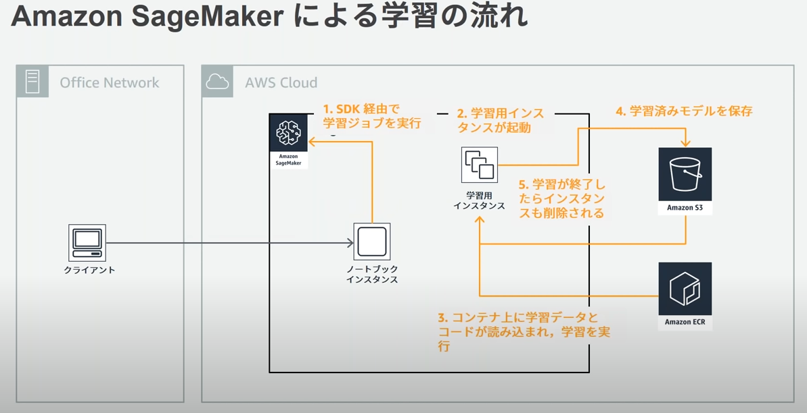
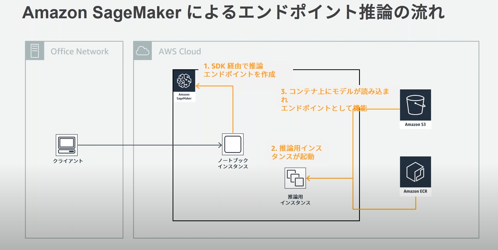

# AWS 認定　機械学習専門知識の学習

機械学習・・・
何それ美味しいの？

というゴリゴリの文系の私が AWS11 冠の最後に残した試験に立ち向かう話

## 試験範囲

[公式の試験ガイド](https://d1.awsstatic.com/ja_JP/training-and-certification/docs-ml/AWS-Certified-Machine-Learning-Specialty_Exam-Guide.pdf)

機械学習の知識そのものが重要になるらしい。

> 基本的な機械学習アルゴリズムの背後にある直感的知識を表現する能力
> 基本的なハイパーパラメーターの最適化の実行に関する経験
> etc

一方で複雑な数学的証明と計算とかそのあたりは試験範囲外らしい

先人たちのいうとおり、これまでの試験とはかなり毛色が違うようだ・・・

- データエンジニアリング
  - 機械学習のデータリポジトリを作成する
    - データソースを特定
    - 何にデータを格納する？（DB,データレイク、S3,EFS,EBS)
  - データ取り込みのソリューション
    - Kinesis, Kinesis Analitics, Firehose,EMR,Glue
    - ↑ この辺りは先に受けたデータ分析の試験の経験がいかせそう
  - データ変換ソリューション
    - この辺も EMR, AWS Batch, Glue など
  - などなど
- 探索的データ分析
- モデリング
- 機械学習の実装とその運用

見ていると、機械学習の知識もそうだがグラフ化（視覚化）とかもあるので数学的知識がある方の方が学習は楽そう（当たり前ですが）

## 基本知識のインプット

そもそも機械学習に関する用語とかも知らないレベルなのでまずは G 検定のテキストを流し読み

https://www.amazon.co.jp/dp/B08GM16335/ref=dp-kindle-redirect?_encoding=UTF8&btkr=1

教師あり学習・教師なし学習・回帰・分類などのふわっとした意味を理解・・・

まだまだ足りないが、このままでは勉強に飽きてしまうので一旦次のステップへ

## BlabkBelt

SageMaker から始まり、BlackBelt の動画を見ることに。

書籍の学習で疲れていた心を AWS Japan の方のわかりやすい説明で癒してくれる・・・

[公式のブラックベルトまとめ](https://aws.amazon.com/jp/aws-jp-introduction/aws-jp-webinar-service-cut/)から機械学習のところの動画を視聴

いつも試験のたびにお世話になっております。

### SageMaker BasicSession

これまでの課題

- 開発・学習
  - 環境構築大変
  - 複数の学習ジョブを並列で実行するのが大変
  - etc
- 推論
  - 推論用の API サーバー構築とメンテが大変
  - エッジデバイスへのデプロイが大変
  - バッチ推論の仕組みを構築するのが大変

要するに、データサイエンティストが機械学習の仕組みを作って、エンジニアがそれを API サーバーにデプロイしたりするのに対して、大変。

これらを解決するための SageMaker があるらしい

#### 概要メモ

- Jupyter NoteBook をオンライン上で実施できるようだ
- テンプレートがたくさんある
  - 20219 年のブラックベルトではライブラリは Chainer で説明されていた
    - ビルドインアルゴリズム・・・データだけあればすぐできる
    - Tensoflow とか Chainer とか PyTorch とか・・・スクリプトとデータがあればすぐできる
    - 独自アルゴリズム・・・自分で ECR のイメージ作ったりとか必要
  - Pytorch とか
  - この辺りのテンプレがたくさんあるので、環境構築の必要がない
- SageMaker のコンポーネント
  - ラベリング
    - 機械学習のためのインプットデータ作成を支援。ウェブベースのツールを提供。画像や文章などに対して効率的にラベル付を行える
  - 開発
    - 学習するためのコードの記述・入力データの加工整形など。Jupyter NoteBook やその他ライブラリがインストール済みのインスタンスを提供
  - 学習
    - API を叩くと学習用インスタンスが立ち上がり、学習ジョブを実行。複数ジョブの同時実行や、複数インスタンスでの分散学習、ハイパーパラメータチューニングに対応
  - モデル変換
    - 学習済みのモデルに対して実行環境に最適化された形でのモデル変換機能を提供。EC2 インスタンスやエッジデバイスに最適化された形のモデルを作成できる
    - ハイパーパラメーターの調整とかも自動ですることが可能
  - 推論
    - API を叩くと指定したモデルを読み込んでオートスケーリングや AB テストに対応したエンドポイントが作背できる
    - 大量データをバッチで推論する処理もサポート

#### SageMaker の学習・推論

#### 開発

- ノートブック上で前処理やプロトタイピングも簡単に利用可能
- git リポジトリを SageMaker に設定しておけばすぐにコードを使うことも可能
- 環境変数の設定や・コンテナのライフサイクルとかも設定できる

#### 学習

学習のアーキテクチャ

- 分散処理もできるけど Tensorflow などの Python 処理は自分で書く必要がある
- `estimator.fit(wait=False)`とするとジョブの終了を待たない
- Estimater の初期化時に　 hyperparameters で引き渡すパラメータでハイパーパラメーターを自動で調整してくれる
- ローカルモードでテストをできる（いちいちインスタンスを立ち上げずにさくっっとテスト)
- アルゴリズム・ハイパーパラメーターの設定、タグなどで合致するデータを検索できるサーチサービスもあり

#### 推論

推論のアーキテクチャ

- AB テストの機能もあり
- 複数のもでるそぞれぞれに、インスタンスタイプやインスタンス数とか設定可能
- 推論パイプライン
  - 複数の推論エンドポイントを一連おパイプラインとして定義可能
  - 前処理用のコンテナ・分類用のコンテナ・後処理用のコンテナというふうにパイプラインを組むことができる
  - ElasticInference CPU のみの EC2 に GPU のアクセラレーター処理を後からアタッチできたりする

#### SageMaker の活用方法

- 開発・学習・推論のいずれかだけ利用するとか、利用しないとかもちろん可能
  - 本番は
    StepFunctions のワークフローで Glue や SageMaker について lamdba を使わずに利用することが可能
