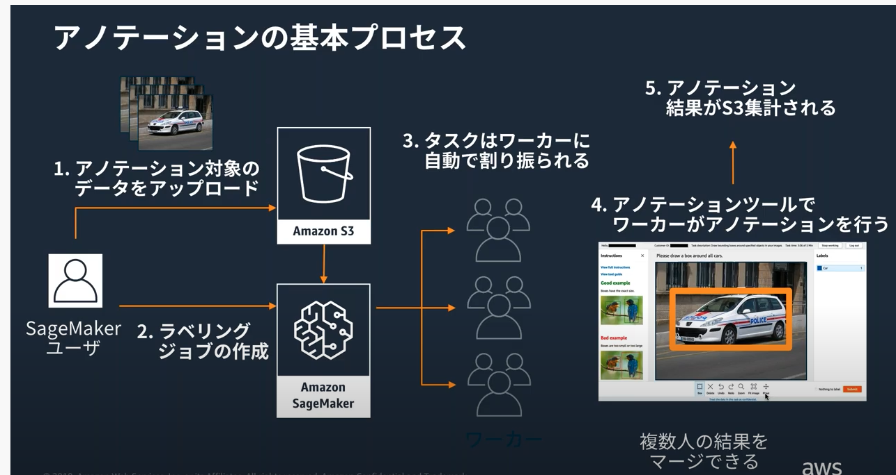
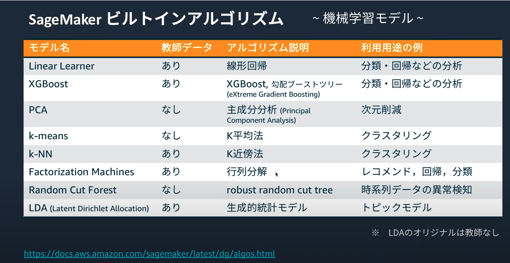

# SageMaker AdvanceSession

- ラベリング
  - 教師データラベリングの支援ツール
  - データのラベル付（アノテーション）にはコスト・時間がかかる
  - 効率の良いアノテーションツールの作成
  - 進捗管理・作業割り振り
  - 大量データのラベル付け
- 開発
- 学習
- モデル変換・推論

## SageMaker Notebook instance

- SageMaker 上のワークフローを Python SDK で記述する

## ラベリング（アノテーション）

- SageMakdr GroundTruth
  - アノテーションにおける一般的なワークフローの管理ツール
  - ラベルを付与するワーカは MechanicalTurk,マーケットプレイスによる外部ベンダとかから選択可能
    - 画像を判断してラベリングしていく人
  - 画像分類
    - この画像はサッカーではなくバスケットボールをやっているな・・・とかいう画像の分類
  - 物体検出
  - セマンティックセグメンテーション
  - 文章分類
  - 自動ラベリングの機能もあり

## モデル開発

- モデル生成の方法
  - ビルトインアルゴリズムを使う
    - SageMaker 上での実装を最適化した機械学習アルゴリズム
    - アルゴリズムごとにコンテナが潤されていて、分散学習などが簡単に使える
  - 自前の学習用スクリプトを使う
    - TensorFlow
    - PyTorch
    - Chainer
    - この辺りを使って開発できる
  - AWS マーケットプレイスで他社が作成した機械学習のモデルを購入することもできる
    - マーケットプレイス上でアルゴリズムの選択
    - SasgMaker 上でアルゴリズム登録
    - トレーニングジョブの作成・実行
    - すでに学習済みのモデルの API を叩いて、推論の結果を得ることもできる

※メモ: この辺りのアルゴリズムがどういうもので、どのような時に最適化をわかるようにしておく必要がありそう

## 学習

- TensorFlow などを使って分散学習できる
  - セッションないで Python コードの例があった
  - ハイパーパラメーター探索の結果をコンソールでも確認できる

## モデル変換・推論

- SageMaker Neo: モデル変換による推論の高速化
  - SageMaker で学習したモデルを推論環境に最適化された形にコンパイルできる
- デプロイプラットフォーム上の使用料を 1/10 程度に削減、推論の高速化
- ML フレームワークの機能をどこでも実行できる単一のコンパイル環境に変換
- EC2 とかで動かせる
- CPU インスタンスの計算を GPU でアクセラレート
  - 適切な GPU リソースを CPU に関連づけることで高速な推論を低コストで実行
- Amazon Elastic Interface

  - 推論に適した低コストの GPU 駆動のアクセラレーションとか
  - TensorFlow などのコード上で EIA を指定する

- SageMaker Reinforcement Learning
  - ゲームやロボットのシミュレーション環境と統合した SageMaker 上の強化学習
  - 教科学習ツールキットとして Coach と RL-Ray をサポート
  - 強化学習ライブラリを利用し、分散学習環境
