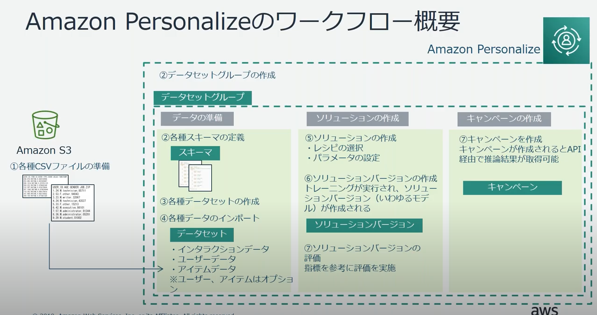

# AWS Personalize

Amazon.com と同様のテクノロジーを使用して、機械学習の経験が不要なリアルタイムパーソナライゼーション・レコメンデーションサービス

ユーザー向けにパーソナライズしたレコメンデーションを簡単に追加できる機械学習サービス

- ユーザーにおすすめのリストを提供する
- 特定のアイテムに対する類似アイテムのていくよう（この商品を買った方は・・・・）
- 特定のアイテムリストをユーザーの試行に合わせて並び替えて提供（キャンペーン中のアイテムリストをユーザーここに対して並び替えて表示)

- EC2 でアプリケーションを動作
- そのデータを RDS に保存
- その中から必要な情報を S3 にエキスポート
- Personalize から読み取って機能を提供

## Personalize の用語

- データセットグループは各種データセットをまとめる概念
  - Interactions
  - Users
  - Items
- レシピ
  - レコメンデーションで利用するアルゴリズム
  - User Personalization
  - Personalized Ranking
  - Related Items
- ソリューション
  - 機械学習のモデルに相当
- キャンペーン
  - レコメンデーションの API 呼び出しで利用するホスティング環境
- イベントトラッカー
  - リアルタイムのインタラクションイベントを API 経由で収集する仕組み

## Personalize のワークフロー

## 使い方

- S3 へのアクセス権限などが必要
- データの準備
  - CSV データの準備
    - Interactions
      - 全てのレシピで使用
      - ユーザーとアイテム間の過去インタラクションデータを提供
      - 購買履歴、視聴履歴など
    - Users
      - ユーザーに関するメタデータを提供
      - 年齢とか性別とか
    - Items
      - アイテムのメタデータ
      - ジャンルとか
- ソリューション作成
  - レシピの選択
- キャンペーンの作成
  - API 呼び出しを行うためのもの
  - 先ほどレシピを選択して作成したソリューションのバージョンを指定する（ソリューションバージョン）
- イベントトラッカーの作成（オプション）
