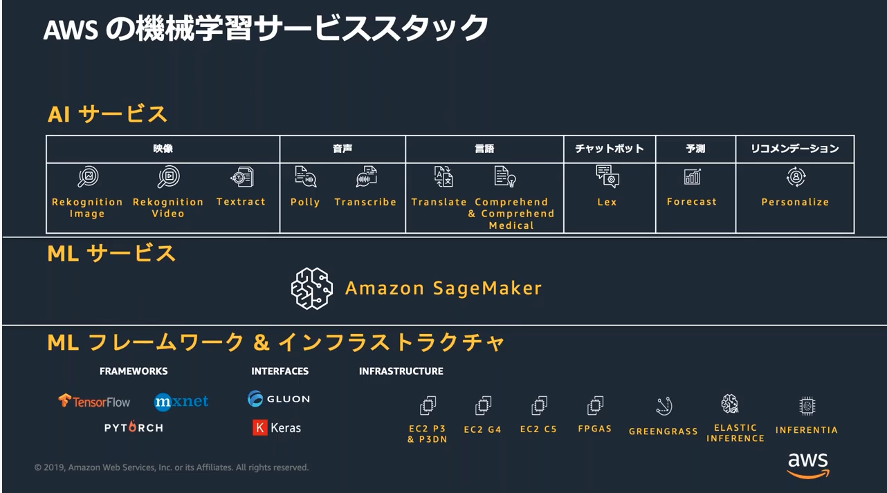

# AWS PollyのBlackBelt視聴

- AIサービス
  - データを用意するだけでAPIから機械学習を利用できる
  - 利用する機械学習はAWSによって最適な実装がされている
  - 10種類のAIサービスを提供
    - 静止画・動画認識(Recognition)
    - 音声処理
    - テキスト処理
    - チャットbot
    - 時系列データ予測
    - レコメンデーション
- MLサービス
  - SageMaker
- MLフレームワーク・インフラストラクチャ

## Recognition

- 画像・動画の認識サービス
- さまざまなな認識機のをAPIで提供し、アプリから利用する
- どういうことするのか？
  - 静止画の処理
  - 動画の処理
- 物体検出
  - 画像の中に出ている人・モノの検出
  - 四角い枠での認識
- 安全ではない動画の検出
  - アダルトとか
  - 暴力的
  - 過激な描写とか
- 顔検索
  - 顔が写った写真を顔検索で
- 動線の検出
  - 人が動いた線を出す
  - 販促とかに活かせる
- 画像・動画・音声の識別結果をElasticSearchに保存して検索する
- 1ヶ月あたり画像処理 * 100万枚まで1.3$

## Textract

- PDF / 画像のテキストと構造情報を抽出するマネージドサービス
- テキスト検索のインデックス作成
- コンプラチェック
- 画像とPDFを利用できる
  - 画像は単一のページ
  - PDFは各ページはページとして処理される
- ブロック
  - ページ
  - ライン
  - テーブル
  - Key/Valueセット
- 源泉徴収票の写真を撮影する場合
  - S3
  - Lamdba
  - Textract
  - Lamdba
  - ES

## AmazonPolly

- テキストを音声に変換する音声認識サービス
- SSMLとLexiconによるい音声のカスタマイズが可能
- 日本語を含む複数の言語でサポート
- 機能
  - SSML
  - Lexicon
      - どちらも音声認識のための企画xmlみたいなので、音声の大きさとか速さ・発音をカスタマイズできる
  - スピーチマーク
    - Pollyが合成する音声を表すメタデータを取得する機能
  - ニューラルテキスト読み上げ機能
    - より自然に読むための機能
    - ニュースキャスターが読み上げるようなものにすることもできる
- どういうふうに使うのか
  - RSS
  - Lamda
  - Polly
  - Lamda
  - S3に保存

